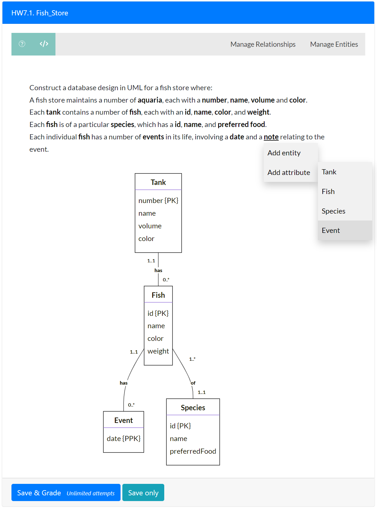

# AutoER: Automatic UML Design Marking integrated into PrairieLearn

The AutoER system supports students learning database design diagrams by providing real-time visualization and feedback during question answering. It targets users first learning the design concepts and process of extracting model elements from written text. Students can answer instructor-created or randomly generated
questions by interacting with the question text to develop the design. Unlike other UML design software, the student selects the modeling construct to add (entity, attribute, relationship) but does not directly draw the construct on the diagram itself. The diagram is drawn based on the student answer dynamically.

From the instructor perspective, the AutoER system is completely configurable including the user interface presented to students, the evaluation and feedback, and the parameters and approach for question generation. A demonstration is available at: https://autoed.ok.ubc.ca/demo including a [demo video](https://www.youtube.com/watch?v=Cxi6Jq4MyDk). Instructors may allow their students to use the demonstration site for practice.

The figure below shows the user interface and a student answering the question. The question text contains markup that allows students to select particular words and phrases to add to the diagram. Context-sensitive pop-up menus allow for adding entities and attributes. As the student builds the diagram, it is displayed and can be edited by adding and removing entities, attributes, keys, and relationships. The system uses a text representation of the diagram when evaluating and providing feedback.

AutoER is integrated into the PrairieLearn system and may also be deployed stand-alone.

## Publications

1. S. Foss, T. Urazova, R. Lawrence, Automatic generation and marking of UML database design diagrams, SIGCSE 2022: The 53rd ACM Technical Symposium on Computer Science Education, Providence, RI, USA, March 3-5, 2022, Volume 1, ACM, 2022, pp. 626–632. doi:10.1145/3478431. https://dl.acm.org/doi/10.1145/3478431.3499376

2. S. Foss, T. Urazova, R. Lawrence, Learning UML database design and modeling with AutoER, Proceedings of the 25th International Conference on Model Driven Engineering Languages and Systems: Companion Proceedings, MODELS 2022, Montreal, Quebec, Canada, October 23-28, 2022, ACM, 2022, pp. 42–45. https://doi.org/10.1145/3550356.3559091

## License

## PrairieLearn

PrairieLearn is an online problem-driven learning system for creating homeworks and tests. It allows questions to be written using arbitrary HTML, JavaScript, and Python, thus enabling very powerful questions that can randomize and autograde themselves, and can access client- and server-side libraries to handle tasks such as graphical drawing, symbolic algebra, and student code compilation and execution.

Documentation website: [https://prairielearn.readthedocs.io/](https://prairielearn.readthedocs.io/)

