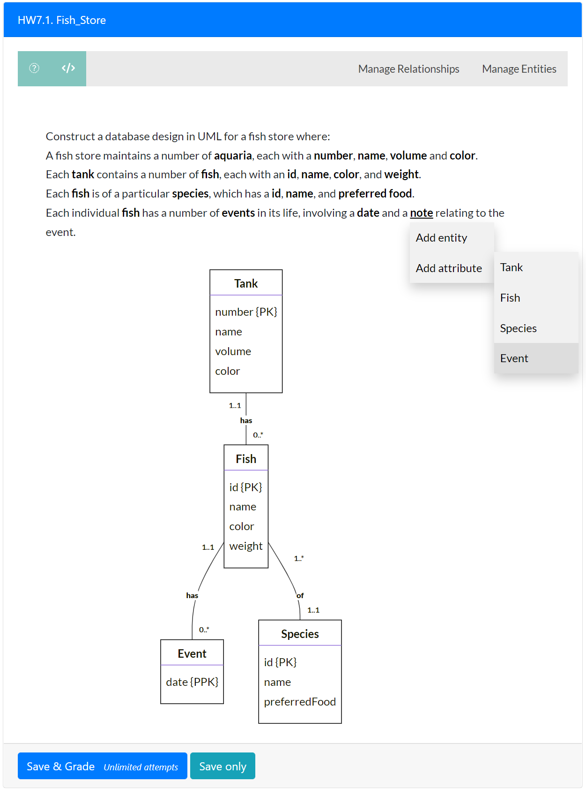
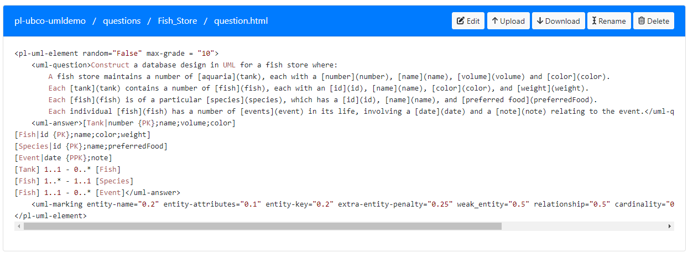
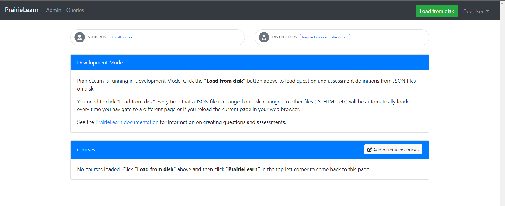
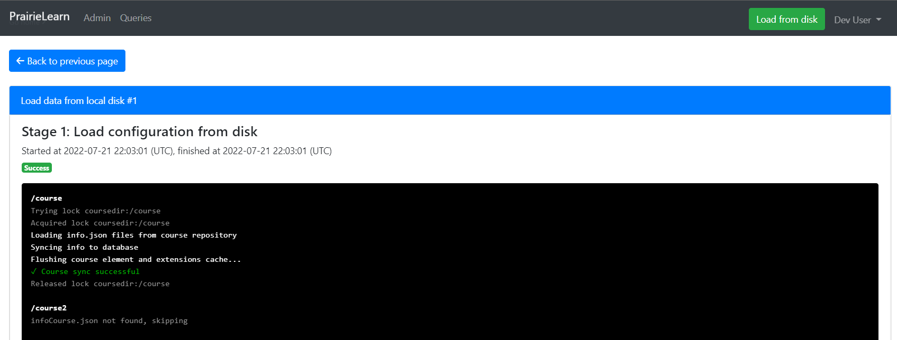

# AutoER: Automatic UML Design Marking integrated into PrairieLearn

The AutoER system supports students learning database design diagrams by providing real-time visualization and feedback during question answering. It targets users first learning the design concepts and process of extracting model elements from written text. Students can answer instructor-created or randomly generated
questions by interacting with the question text to develop the design. Unlike other UML design software, the student selects the modeling construct to add (entity, attribute, relationship) but does not directly draw the construct on the diagram itself. The diagram is drawn based on the student answer dynamically.

From the instructor perspective, the AutoER system is completely configurable including the user interface presented to students, the evaluation and feedback, and the parameters and approach for question generation. A demonstration is available at: https://autoed.ok.ubc.ca/demo including a [demo video](https://www.youtube.com/watch?v=Cxi6Jq4MyDk). Instructors may allow their students to use the demonstration site for practice.

The figure below shows the user interface and a student answering the question. The question text contains markup that allows students to select particular words and phrases to add to the diagram. Context-sensitive pop-up menus allow for adding entities and attributes. As the student builds the diagram, it is displayed and can be edited by adding and removing entities, attributes, keys, and relationships. The system uses a text representation of the diagram when evaluating and providing feedback.

AutoER is integrated into the PrairieLearn system and may also be deployed stand-alone. This repository contains a course for use with PrairieLearn. To test the system in your own deployment, install PrairieLearn and import this repository as a course.

Instructors create questions by editing the `question.html` file. The HTML document has a root element `pl-uml-element`. If `random=False`, the question is instructor created and has only one variant. Otherwise, a random question and answer is generated each time the student attempts the question. The instructor can set the maximum grade using the `max-grade` attribute. The question markup is in a `uml-question` tag. This text appears to the user. Any element specified in square brackets is shown as a link and the text following in round brackets is the text that is added to the diagram. In the image below, `[aquaria](tank)` will have the link on the word `aquaria` and when added to the diagram the word `tank` is used. This markup allows for the written text to be different than the names used in the diagram. The system marks based on the diagram names.

The `uml-answer` tag contains an answer to the question in the text format. If there is more than one answer, put more than one `uml-answer` element. The system will mark against all answers and give the student the highest mark from any of the answers. The answer text format is entities in square brackets. Attributes are after the `|`. Attributes designed as primary keys are annotated with `{PK}` and partial primary keys as `{PPK}`. Relationships consist of the entity name, the cardinality, a separator `-`, the other cardinality, then the other entity name. See the example below.

Marking is customizable to award different marks for entities, attributes, keys, and relationships. This can be modifeid by changing the weights in the `uml-marking` entity.

## Publications

1. S. Foss, T. Urazova, R. Lawrence, Automatic generation and marking of UML database design diagrams, SIGCSE 2022: The 53rd ACM Technical Symposium on Computer Science Education, Providence, RI, USA, March 3-5, 2022, Volume 1, ACM, 2022, pp. 626–632. doi:10.1145/3478431. https://dl.acm.org/doi/10.1145/3478431.3499376

2. S. Foss, T. Urazova, R. Lawrence, Learning UML database design and modeling with AutoER, Proceedings of the 25th International Conference on Model Driven Engineering Languages and Systems: Companion Proceedings, MODELS 2022, Montreal, Quebec, Canada, October 23-28, 2022, ACM, 2022, pp. 42–45. https://doi.org/10.1145/3550356.3559091

## Installation

1. Setup PrairieLearn using the [Docker deployment instructions](https://prairielearn.readthedocs.io/en/latest/docker/).

2. Clone this repository and put it into the directory TODO.

3. Open a browser to URL http://localhost:3000. PrairieLearn will be running in development mode. Click on ``Load from disk`` to load course directory containing the AutoER code and questions into PrairieLearn instance.

- Once load from disk is complete, courses properly mounted will be visible to access.

## Usage

1. A video demonstrating use is [available](https://www.youtube.com/watch?v=Cxi6Jq4MyDk). From main PrairieLearn home screen, select the course AutoER Demo. 

## File Description

- The folders `clientFilesCourse`, `courseInstances/Sum22`, and `serverFilesCourse` are files used by PrairieLearn to define a course and course instance. They can be modified for your own course.

- The main code base for the AutoER system is in the folder `elements/pl-uml-element` that contains the custom PrairieLearn element for graphically creating UML/ER diagrams and performing auto-marking.
    - Key files: `randomgrader.py` - performs grading, `pl-uml-element.py` - defines the overall element, `randomgeneration.py` - random question generator

- The `questions` folder contains the sample questions. Each question has an `info.json` file that defines its metadata including title, and a `question.html` that provides the question text markup, answer(s), and marking guide. New questions can be created using the PrairieLearn user interface or by copying one of the question folders and editing its `info.json` and `question.html` files.

## License

## PrairieLearn

PrairieLearn is an online problem-driven learning system for creating homeworks and tests. It allows questions to be written using arbitrary HTML, JavaScript, and Python, thus enabling very powerful questions that can randomize and autograde themselves, and can access client- and server-side libraries to handle tasks such as graphical drawing, symbolic algebra, and student code compilation and execution.

Documentation website: [https://prairielearn.readthedocs.io/](https://prairielearn.readthedocs.io/)

